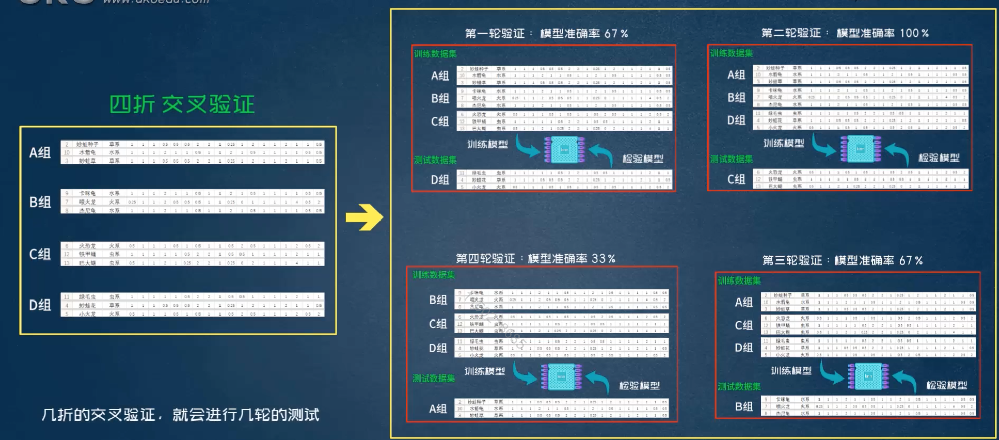
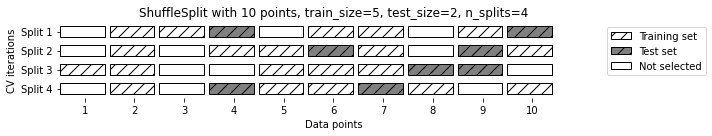

# 【机器学习应用】【Python】模型评估（1）—— 交叉验证Cross Validation

> 以KNN算法举例，在某一组训练集与测试集的数据下可能k=3准确率最高，换一组可能就k=5最高，因此得出的结果不够客观。如果重复多次随机抽样分组，实际上到最后模型已经“见过”所有数据，不能反映模型真实准确率情况。

## 交叉验证
将数据划分为多组，通过多组组合分别组合成训练集和测试集，然后取不同的数据集组合的准确率作为该样本的准确率。

举例来说，我们将手里的数据随机分为四组数据（分别标为a，b，c，d），我们每次选择其中的一组作为测试集，其他三组作为训练集，就能够得到abc，abd，acd，bcd四组训练集组合。


分成四组，就进行四次测试，然后再将四次的预测结果取平均，得到模型的一个综合准确度。

为了防止模型在交叉检验时就“看”到了所有的数据，我们在交叉检验前可将数据先分成训练集和测试集，只用训练集去做分许检验，最后再用测试集去检验模型的最终效果。在交叉检验中验证模型的数据集又叫做验证集(validation)
## cross_val_score()
我们可以直接使用`cross_val_score()`对数据进行交叉检验，默认的检验次数为5。
```python
from sklearn.datasets import load_iris
from sklearn.model_selection import train_test_split, cross_val_score
from sklearn.neighbors import KNeighborsClassifier
from sklearn.linear_model import LogisticRegression

# 加载数据
iris_data = load_iris()

X_train, X_test, y_train, y_test = train_test_split(iris_data.data, iris_data.target, random_state=42)

# 创建模型
logreg = LogisticRegression()
knn = KNeighborsClassifier()

# 交叉检验
scores_logreg = cross_val_score(logreg, X_train, y_train)
scores_knn = cross_val_score(knn, X_train, y_train)

print(f"Cross-validation scores for logistic regression: {scores_logreg}")
print(f"Cross-validation scores for knn: {scores_knn}")

# 计算平均准确率
print("Average cv scores for logistic regression: {:.2f}".format(scores_logreg.mean()))
print("Average cv scores for knn: {:.2f}".format(scores_knn.mean()) )
```
输出：
```
Cross-validation scores for logistic regression: [1., 1., 0.86363636, 1., 0.95454545]
Cross-validation scores for knn: [0.95652174, 1., 0.81818182 , 1., 0.95454545]
Average cv scores for logistic regression: 0.96
Average cv scores for knn: 0.95
```
## KFold
最常用的交叉检验方法是**k折分类器(k-fold)**，常用的折数为5或10.
```python
from sklearn.model_selection import KFold
kf = KFold(n_splits=6)

print(f"Cross-validation scores for logistic regression: {cross_val_score(logreg, X_train, y_train, cv=kf)}")
```
输出：
```
Cross-validation scores for logistic regression: [1., 1., 0.84210526, 1.     1., 0.94444444]
```
## shuffle-split cross-validation
另外还有一种CV的分组方法——shuffle-split，如下图：


在shuffle-split中可以设定训练集和验证集的比例(train_size, test_size)，每次随机抽取设定比例的数据训练和验证模型，并指定重复次数(n_splits)
```python
from sklearn.model_selection import ShuffleSplit

shuffle = ShuffleSplit(test_size=0.2, train_size=0.6, n_splits=10)
shuffled_scores = cross_val_score(logreg, X_train, y_train, cv=shuffle)
print(f"Cross validation scorss with shuffle split: {shuffled_scores}")
```

```
Cross validation scorss with shuffle split: [0.95652174, 0.91304348, 0.91304348, 1., 0.95652174, 0.95652174, 0.82608696, 0.95652174, 0.91304348, 0.86956522]
```
## 交叉检验的好处
* 排除偶然性因素
* 大致了解模型的上限和下限
