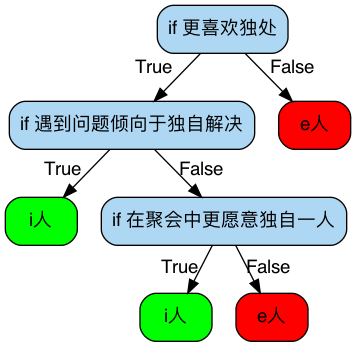
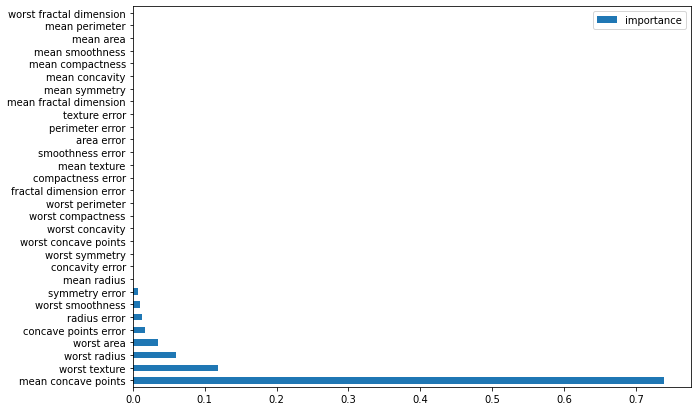

# 【机器学习应用】【Python】决策树 Decision Tree

决策树本质上是if/else语句的集合，通过回答一级一级的if/else问题，最终做出决策。比如，我们利用决策树来判断一个人是e人还是i人，我们就有可能形成以下决策树:


第一个问题被称为**根节点(root)**，之后的每一个分支节点被称为**叶子(leaf)**，这是一个深度为4，叶子为6的简单决策树。

## 决策树的形成
构建一棵决策树，不同的问题顺序，可能会得出不一样的结果。回到实际问题中，一组数据有多个特征，我们应该选择哪些特征构建决策树，如何决定顺序才能够达到更高的效率(更快、更准)呢？

抛开数学公式来理解，其实就是看哪一个特征能更有效地分类数据集。什么是更有效地分类？结合开头的例子，如果仅“是否更喜欢独处“这一个问题，回答“是”的人全都是i人，回答“不是”的全都是e人，一个问题就可以将e人/i人区分开，那么我们就认为，这是个有效问题。

但如果这个问题回答“是”的人中，i人和e人各占一半，那和掷骰子没什么区别，也就是一个没无效问题。


回到决策树算法中，衡量问题（也就是特征）是否有用/有效的指标，叫做**基尼系数**（也是经济学中用来衡量贫富差距的指标）。**基尼系数根据数据集中各类别所占比例计算得出，根据一个特征分类后的数据集基尼系数越小，代表这个特征越有效。**

但在判断是否选取一个特征做节点时，考虑的是分类前数据集的基尼系数$gini_{after}$是否小于未分类前的数据集的基尼系数$gini_{before}$，如果$gini_{before} \leq gini_{after}$，尽管$gini_{after}$再小，也不算有效特征。$gini_{before}$和$gini_{after}$之间的差异称为**信息增益**，当一个特征带来的信息增益为正且在所有特征中最大时，决策树就选取这个特征做节点。

除此之外，我们也可以用**信息熵**来衡量一个特征是否有效。
> **信息熵**用于衡量数据集中信息混乱程度，也就是一组数据里如果什么类别都有，信息熵就高，反之如果只有一种类别，信息熵为0.

根据基尼系数或信息增益，配合更详细的算法设计，我们可以将决策树算法分为三类：
* **ID3决策树** - 信息熵
* **C4.5决策树** - 信息增益率
* **CART决策树** - 基尼系数+最多两个分支（也是sklearn中采用的算法）


再次回到决策树的形成，每次构建一个决策树，我们选取一个特征，然后计算这个特征的基尼系数或信息增益，选取**基尼系数最小**或**信息增益最大**的特征，作为第一个节点。对于分类出来的数据集，我们再测试并计算每一个特征的基尼系数或信息增益。

以此类推，直到最后我们将所有数据都分得清清楚楚，每一个最终节点上的数据，都是百分百纯正（同一类），我们就完成了一个决策树🌲。

## 决策树模型的复杂度
根据特征的数量，以及是否可以重复选择特征构建决策树，理论上可以构造出一个无限深的决策树，可以说这棵决策树过于讨好训练集，致力于将训练集中的每一个数据点正确分类，导致过拟合，降低了模型的泛化能力。

决策树中可以通过调整超参,控制模型的复杂度，避免过拟合的结果。
* `max_depth`：决策树的最大深度；
* `min_samples_leaf`：每个叶子最少包含几条训练数据；
* `min_sample_split`：拆分某节点至少需要该节点包含多少条训练数据；
* `min_weight_fraction_leaf`：每个叶子节点的数据最少要有多少权值；
* `max_feature`：可选取的最多的特征数目；
* `max_leaf_nodes`：一个节点最多能有多少叶子（子节点）等。

## sklearn中的决策树
scikit-learn提供`DecisionTreeRegression`和`DecissionTreeClassifier`两种算法。

下面代码以breast cancer数据为例
```python
from sklearn.datasets import load_breast_cancer
from sklearn.tree import DecisionTreeClassifier
from sklearn.model_selection import train_test_split

cancer = load_breast_cancer()
X_train, X_test, y_train, y_test = train_test_split(cancer.data, cancer.target, random_state=42)

tree = DecisionTreeClassifier(random_state=0).fit(X_train, y_train)

print("Accuracy on training set: {:.3f}".format(tree.score(X_train, y_train)))
print("Accuracy on test set: {:.3f}".format(tree.score(X_test, y_test)))
print("Depth: {}, leaves: {}".format(tree.get_depth(), tree.get_n_leaves()))
```

```
Accuracy on training set: 1.000
Accuracy on test set: 0.930
Depth: 7, leaves: 16
```

在没有控制决策树深度时，在训练集上的准确度为100%，说明模型过拟合了。将`max_depth`设置为4后，得到一个较为合理的结果。
```python
tree_d4 = DecisionTreeClassifier(max_depth=4, random_state=0).fit(X_train, y_train) 

print("Accuracy on training set: {:.3f}".format(tree_d4.score(X_train, y_train)))
print("Accuracy on test set: {:.3f}".format(tree_d4.score(X_test, y_test)))
print("Depth: {}, leaves: {}".format(tree_d4.get_depth(), tree_d4.get_n_leaves()))
```
```
Accuracy on training set: 0.995
Accuracy on test set: 0.951
Depth: 4, leaves: 12
```

### 可视化决策树
要进一步了解机器学习模型，可视化永远都是一个很好的方法。python也给可视化决策树提供很棒的工具包`graphviz`.

```python
dot_data = export_graphviz(tree_d4, out_file=None, feature_names=cancer.feature_names,  
                                class_names=['malignant','benign'],  
                                filled=True, rounded=True,  
                                special_characters=True) 

graph = graphviz.Source(dot_data)  
# 将graph存储为图片(.png)
graph.render('dt_depth4',format='png', view=False)
```


这里的`gini`也就是前面提到的基尼系数，`value`代表每一类别的数量。可以看到，再经过**mean concave points**这一特征的分类后，两种类别在是或否的分支上，数量差距都更大了。

💡 对于数值数据，决策树会找出多个数据分界线一一测试，选择信息增益最大的分界线作为节点的判断条件。对于类别数据，则需要先将数据类别预处理为数值，再根据信息增益选取节点。

## 特征重要性(feature importance)
另外，决策树模型还计算特征的重要性，取值范围在0到1，0表示“未使用”，1表示“完美地将数据集区分”。


根据上图分析，*mean concave points*是最重要，或者说信息量最大的特征，能够将大部分的数据正确分类。但需要注意的是，重要性为0的特征**并不代表它们不重要，只是它们在这棵决策树没有被用到。**

如果要做更全面的考虑，选择更多的特征参与训练，就需要**集成学习**，集成多个决策树的决策。

## 总结
决策树模型主要有两个优点
* 可以被可视化，直观易理解
* 不需要对数据做特殊处理，数据拿到手就可直接用

但缺点也很明显
* 容易过拟合，泛化性不高
* 不一定考虑所有的特征，忽略其他特征的作用。

> 决策树是一个简单易懂的模型，其算法逻辑也很人类做决策的过程很相似，但如果我们要得到一个泛化性更好的结果，决策树很难做到。

# 参考资料
 1. [《Introduction to Machine Learning with Python》](https://learning.oreilly.com/library/view/introduction-to-machine/9781449369880/)
 2. 代码：https://github.com/PengJuan-AI/Machine-Learning-Practice/blob/main/CSDN_posts/notebooks/DecisionTree%26RandomForest.ipynb