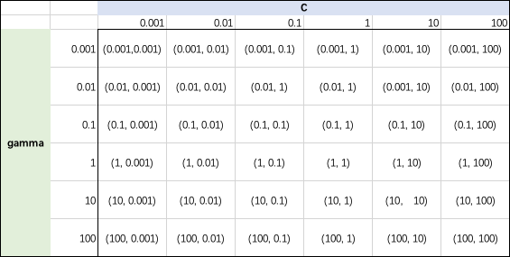

# 【机器学习应用】【Python】模型评估（2）—— 网格搜索 Grid Search

> 机器学习算法都有不同的超参数，通过调整超参找到最优的模型，几乎是每一个用机器学习算法解决问题的必经步骤。

要找到最佳超参数，除了`for`循环以外，还可以使用一个实用的方法——**网格搜索(Grid Search)**。网格搜索其实就是给模型提供一系列我们想要测试的超参数，然后根据不同超参数创建不同模型，并检验它们的准确度。

例如测试从1到10k近邻数的模型准确度：`n_neighbors=range(1,10)`

如果只调整一个超参数，使用`for`循环还比较简单，但当我们要调整两个以上的参数时，就会有n x m个组合需要我们去尝试，也就形成了一个网格。

以调整SVM的C值和gamma值为例：



要测试每个网格的组合，我们可以写一个简单的`for`循环来实现：
```python
# Simple grid search
from sklearn.svm import SVC

best_score = 0

for gamma in [0.001, 0.01, 0.1, 1, 10, 100]:
    for C in [0.001, 0.01, 0.1, 1, 10, 100]:
        # for each combination of parameters, train a SVC model
        svm = SVC(gamma=gamma, C=C)
        svm.fit(X_train, y_train)
        # evaluate
        score = svm.score(X_test, y_test)
      
        if score > best_score:
            best_score = score
            best_parameters = {'C':C, 'gamma':gamma}

print("Best score: {:.2f}".format(best_score))
print("Best parameters combination: {}".format(best_parameters))
```
输出：
```
Best score: 1.00
Best parameters combination: {'C': 100, 'gamma': 0.001}
```

## 网格搜索结合交叉检验
当然，在测试不同超参数时我们会面对同样的问题，那就是训练集的偶然性。为了避免偶然性影响，使模型准确度更加客观，通常我们需要网格搜索和交叉检验结合使用。

sklearn就给我提供了一个强有力的帮手：`GridSearchCV`

### 网格搜索找C值和gamma -- 以SVM为例
```python
from sklearn.model_selection import GridSearchCV
from sklearn.svm import SVC

param_grid = {'C':[0.001, 0.01, 0.1, 1, 10, 100], 'gamma':[0.001, 0.01, 0.1, 1, 10, 100]}
print("Parameter grid:\n {}".format(param_grid))

grid_search = GridSearchCV(SVC(), param_grid, cv=5)

grid_search.fit(X_train, y_train)

gs_scores = grid_search.score(X_test, y_test)
print("Test score with best params: {}".format(gs_scores))
```
输出：
```
Parameter grid:
 {'C': [0.001, 0.01, 0.1, 1, 10, 100], 'gamma': [0.001, 0.01, 0.1, 1, 10, 100]}
Test score with best params: 1.0
```
查看`grid_search`得到的最好的超参数组合和最好的准确率，可以调用`best_params_`和`best_score_`
```python
print("Best params: {}".format(grid_search.best_params_))
print("Best cross-validation score: {:.2f}".format(grid_search.best_score_))
```
输出：
```
Best params: {'C': 100, 'gamma': 0.01}
Best cross-validation score: 0.97
```