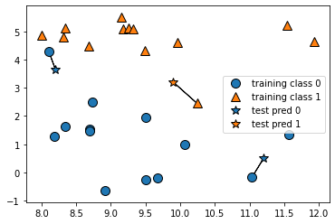
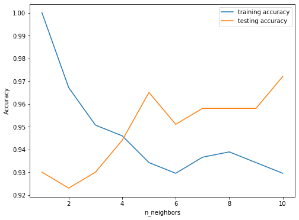

# 【机器学习应用】【Python】K近邻（KNN）

## mglearn
在开始之前再介绍一个机器学习算法的工具包`mglearn`，是《Introduction to Machine Learning with Python》整本书使用的一个工具包，有很多可视化的模块帮助我么理解算法，完整代码参考[github](https://github.com/amueller/introduction_to_ml_with_python)

安装mglearn参考[set up](https://github.com/amueller/introduction_to_ml_with_python/tree/master#setup)
```python
# 终端安装
pip install mglearn

# Jupyter Notebook安装
!pip install mglearn
```

## K近邻简介
K近邻算法是一种适用于回归和分类的机器学习算法，它的基本原理是根据距离某一个数据点最近的k个数据的类别对其进行分类。例如，当k=1时，对于一个数据点，KNN算法会将其分类为离它最近的第一个数据的类别。



通常计算数据点和周围数据的距离方法有三种：
1. 欧氏距离（Euclidean distance）
2. 曼哈顿距离（Manhattan distance）
3. 明可夫斯基距离（Minkowski distance）

## KNN分类
以乳腺癌数据集`load_breast_cancer`为示例：
```python
from sklearn.datasets import load_breast_cancer
from sklearn.model_selection import train_test_split
from sklearn.neighbors import KNeighborsClassifier

cancer_data = load_breast_cancer()
X_train, X_test, y_train, y_test = train_test_split(cancer_data.data, cancer_data.target, random_state=42)

# 创建一个KNN模型
model = KNeighborsClassifier(n_neighbors=3)

# 拟合模型
model.fit(X_train, y_train)

# 预测测试集
y_pred = model.predict(X_test)

# 查看准确度
print("Accuracy: {:.2f}".format(model.score(X_test, y_test)))
```
输出：
```
Accuracy: 0.93
```
### 到底多少个邻居才能确定类别
俗话说，类以物聚，人以群分，但是到底要了解多少一个人身边的邻居，才能更好的了解这个人呢？这时候就需要我们调整k值来测试一下。

k值，也就是我们的近邻数(`n_neighbors`)。目的是告诉KNN算法，在做预测时需要参考一个数据点周围的k个数据。

```python
training_accuracy = []
test_accuracy = []

neighbor_settings = range(1, 11)

for neighbor in neighbor_settings:
    model = KNeighborsClassifier(n_neighbors=neighbor)
    model.fit(X_train, y_train)
    training_accuracy.append(model.score(X_train, y_train))
    test_accuracy.append(model.score(X_test, y_test))

plt.figure(figsize=(8,6))
plt.plot(neighbor_settings, training_accuracy, label="training accuracy")
plt.plot(neighbor_settings, test_accuracy, label="testing accuracy")
plt.ylabel("Accuracy")
plt.xlabel("n_neighbors")
plt.legend()
```
输出：


分析一下结果可以发现，近邻数为5时预测准确度已经达到96.5%左右，之后有一个小幅度的下降。在近邻数为10时准确度有明显的提升，但是训练准确度却有所下降。目前来看呢，近邻数为5较为合适。

将不同k值的knn决策分界可视化，不同k值的作用更加直观。k=1的分界线会尽可能的将每一个数据点分类，而k值越大，决策分界线就会越平滑，泛化能力相对更好。


## KNN回归

```python
from sklearn.neighbors import KNeighborsRegressor
from sklearn.datasets import make_regression

X, y = make_regression(n_samples = 100, n_features=1,
                        n_informative=1, bias = 150.0,
                        noise = 30, random_state=0)

X_train, X_test, y_train, y_test = train_test_split(X, y, random_state=42)

knnreg = KNeighborsRegressor().fit(X_train, y_train)

# Compare with linear regssion
from sklearn.linear_model import LinearRegression

linreg = LinearRegression().fit(X_train, y_train)

print("KNN regression test set score (R^2): {:.3f}".format(knnreg.score(X_test, y_test)))
print("Linear regression test set score (R^2): {:.3f}".format(linreg.score(X_test, y_test)))
```
```
KNN regression test set score (R^2): 0.609
Linear regression test set score (R^2): 0.714
```
同样将不同k值的回归线可视化，回归线随着k值的增大越加平滑。


## 总结
> 一般来说，K近邻是机器学习中最简单的算法之一，近邻数和距离算法是KNN两个重要的参数。

优点：KNN算法比较容易理解，可解释性强，可以作为解决分类/回归问题的baseline。
缺点：不适合用于特征维度高的数据集，也不适合于稀疏数据集（有很多特征，大多数值为0）；当数据量和近邻数较大时，运行时间较长。

完整代码可参考：
