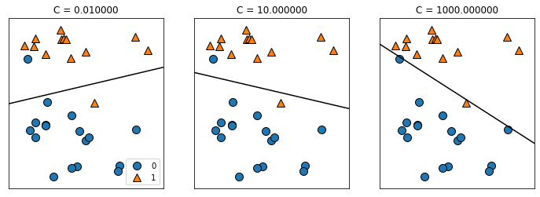

# 【机器学习应用】【Python】线性模型 Linear Models

## 线性回归
> 线性模型是机器学习的基础模型之一，也是被广泛运用的一类模型，其中包括最小二乘回归，Ridge回归和Lasso回归等。

在二元线性回归中，线性回归的目标是找到一条线，这条线离所有数据点的距离最小，我们可以根据这条线预测一个新数据点的位置。将二元线性回归扩展到更高维度的数据，目标就变成了找到数据之间的一个超平面(hyperplane).

线性回归的超参数有$w$和$b$，也就是斜率(slope)和截距(intercept). 基于不同的计算超参数的方法，以及模型的复杂度，线性回归模型基本上有OLS，Ridge和Lasso三种。

### Linear Regression （最小二乘法OLS）
OLS回归时最简单的线性回归模型，它通过最小化均方误差计算出斜率$w$和截距$b$。均方误差，又称MSE(mean suqre error)即为预测值和真实值之间的平方差。

以波士顿房价(boston)数据为例构建一个OLS回归模型：
```python
from sklearn.datasets import load_boston
from sklearn.model_selection import train_test_split
from sklearn.linear_model import LinearRegression

data = load_boston()
X_train, X_test, y_train, y_test = train_test_split(data.data, data.target, random_state=1)

linreg = LinearRegression().fit(X_train, y_train)

print("Training score with linear regression: {:.2f}".format(linreg.score(X_train, y_train)))
print("Test score with linear regression: {:.2f}".format(linreg.score(X_test, y_test)))
```
输出：
```
Training score with linear regression: 0.72
Test score with linear regression: 0.78
```

### Ridge Regression

Ridge Regression（岭回归）使用也是最小二乘法，但是在计算斜率$w$的时候，加上了一个限制——所有的$w$要尽可能的接近0——也就是说Ridge回归希望每个特征对结果的影响都尽可能小。

这样的限制也叫做**正则化(regularization)**，目的是避免模型过拟合，提高模型范化性能。正则化分为L1正则化和L2正则化，也称为L1范数和L2范数。这里Ridge回归使用的是L2正则化。

```python
from sklearn.linear_model import Ridge
ridge = Ridge().fit(X_train, y_train)

print("Training score with Ridge regression: {:.2f}".format(ridge.score(X_train, y_train)))
print("Test score with Ridge regression: {:.2f}".format(ridge.score(X_test, y_test)))
```
输出：
```
Training score with Ridge regression: 0.71
Test score with Ridge regression: 0.78
```
从以上结果我们可以看出，受到正则化影响，测试集的准确率没有变化的情况下，训练集的准确率降低了。超参数`alpha`可以调整正则化对模型的影响大小，权衡模型复杂性和模型准确率。**`alpha`越大，所有的变量的系数越趋向于0，模型越简单，同时也会降低模型在训练集的准确性。**

alpha的最有取值是具体情况而定，我们可以用[Grid Search](https://blog.csdn.net/pj71945/article/details/132374754)去找最优值。
```python
ridge10 = Ridge(alpha=10).fit(X_train, y_train)
ridge01 = Ridge(alpha=0.1).fit(X_train, y_train)

print("Training score with Ridge regression(alpha=10): {:.2f}".format(ridge10.score(X_train, y_train)))
print("Training score with Ridge regression(alpha=0.1): {:.2f}".format(ridge01.score(X_train, y_train)))
print("Test score with Ridge regression(alpha=10): {:.2f}".format(ridge10.score(X_test, y_test)))
print("Test score with Ridge regression(alpha=0.1): {:.2f}".format(ridge01.score(X_test, y_test)))
```
输出：
```
Training score with Ridge regression(alpha=10): 0.70
Training score with Ridge regression(alpha=0.1): 0.72
Test score with Ridge regression(alpha=10): 0.78
Test score with Ridge regression(alpha=0.1): 0.78
```

我们也可以通过mglearn的可视化了解正则化在不同大小数据集上的效果。
`mglearn.plots.plot_ridge_n_samples()`

**总结：当数据集的较小时，用ridge regression能够得到更好的准确率。当数据集足够大的时候，是否有正则化的影响不大，数据集越大，越能避免过拟合。**

### Lasso
另一种叫有限制的线性回归是Lasso。Lasso使用的限制方法叫做L1正则，也是让系数趋近于0。但是L1正则会使得一些特征/变量的系数等于0，也就是说一些特征会在训练时不被考虑，也可以看作是特征筛选的形式之一。
```python
from sklearn.linear_model import Lasso

lasso = Lasso().fit(X_train, y_train)

print("Training score with Lasso regression: {:.2f}".format(lasso.score(X_train, y_train)))
print("Test score with Lasso regression: {:.2f}".format(lasso.score(X_test, y_test)))

# 查看lasso模型和ridge模型不为0系数的数量
print("Number of features used in Lasso: {}".format(np.sum(lasso.coef_!=0)))
print("Number of features used in Ridge: {}".format(np.sum(ridge.coef_!=0)))
```
输出：
```
Training score with Lasso regression: 0.65
Test score with Lasso regression: 0.66
Number of features used in Lasso: 9
Number of features used in Ridge: 13
```
可以看出Lasso的结果较差，相较于Ridge使用了更少的特征/变量。这种情况可能是因为模型过于简单，导致欠拟合，所以在调整超参数时，我们可以考虑降低alpha。

在实际应用中，是否使用Lasso，可以考虑以下情况：
* 数据集有很多特征，但只有少数特征是重要的；
* 需要模型相对简单，易理解。

## 线性分类
> 线性模型除了用于解决回归模型之外，也可以用于解决分类问题，本文介绍两种解决分类问题的线性模型——逻辑回归(Logistics Regression)和线性支持向量机(Linear SVMs)

线性回归得到的模型是一条线，一个平面或一个超平面。而用于分类问题的线性模型，得到的是线性分类器，平面分类器或超平面分类器。举例来说，对于二元分类（只有两种类型的分类问题），线性模型就是一条将两种类别分开的线。

最常见的分类线性模型是逻辑回归(Logistic Regression)和线性支持向量机(Linear SVMs)。

两种模型调整正则化的参数是`C`，`C`越大，正则化的程度越少，`LogisticRegression`和`LinearSVC`也就越可能过拟合。 

`mglearn.plots.plot_linear_svc_regularization()`可视化不同`C`值的影响。


上图对比了不同`C`值下`LinearSVC`的分类效果，`C`值较大时，分界线会尽可能的将每一个数据点正确分类。

## 逻辑回归
我们以breast cancer数据集为例。
```python
from sklearn.datasets import load_breast_cancer
from sklearn.linear_model import LogisticRegression
cancer_data = load_breast_cancer()
X_train, X_test, y_train, y_test = train_test_split(cancer_data.data, cancer_data.target, random_state=42)

logreg = LogisticRegression().fit(X_train, y_train) # default=1
logreg001 = LogisticRegression(C=0.01).fit(X_train, y_train)
logreg100 = LogisticRegression(C=100).fit(X_train, y_train)


print("Training score with Logistic regression(C=1): {:.2f}".format(logreg.score(X_train, y_train)))
print("Training score with Logistic regression(C=0.001): {:.2f}".format(logreg001.score(X_train, y_train)))
print("Training score with Logistic regression(C=100): {:.2f}".format(logreg100.score(X_train, y_train)))
print("Test score with Logistic regression(C=1): {:.2f}".format(logreg.score(X_test, y_test)))
print("Test score with Logistic regression(C=0.001): {:.2f}".format(logreg001.score(X_test, y_test)))
print("Test score with Logistic regression(C=100): {:.2f}".format(logreg100.score(X_test, y_test)))
```

```
Training score with Logistic regression(C=1): 0.95
Training score with Logistic regression(C=0.001): 0.92
Training score with Logistic regression(C=100): 0.95
Test score with Logistic regression(C=1): 0.97
Test score with Logistic regression(C=0.001): 0.96
Test score with Logistic regression(C=100): 0.97
```

另外需要注意的是，在分类模型中：
* `model.predict(X_test)`返回的是类别的`label`，例如0或1。
* `model.predict_proba(X_test)`返回的是每一条数据是某一个类别的可能性，在二元分类问题中，一般默认大于返回值0.5位类别1，反之为类别0。

# 总结
无论使用线性模型解决回归问题还是分类问题，我们都需要考虑超参数`alpha`或`C`的取值，以及使用L1正则化还是L2正则化。通常来说，当数据中只有少数重要特征时，应该使用L1，L1正则化会简化模型提高模型可解释性(interpretability)，因为其只考虑了少数特征。反之应该用L2正则化。

其次，线性模型还适合于当数据中特征数量大于数据总量的情况。但对于数据维度较少（特征较少）的情况，其他模型可能会有更好的泛化能力。

关于正则化更详细的解释可参考: 
[机器学习中正则化项L1和L2的直观理解](https://blog.csdn.net/jinping_shi/article/details/52433975)
