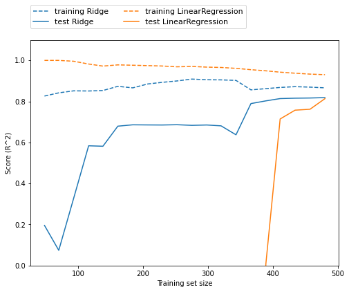

> 线性模型是机器学习的基础模型之一，也是被广泛运用的一类模型，其中包括逻辑回归，Ridge回归和Lasso回归等，它们可以运用于监督学习的回归和分类任务。

在二元线性回归中，线性回归的目标是找到一条线，这条线离所有数据点的距离最小，我们可以根据这条线预测一个新数据点的位置。将线性回归扩展到更多维度的数据，目标就变成了找到数据之间的一个超平面(hyperplane).

线性回归的超参数有w和b，也就是斜率(slope)和截距(intercept). 基于不同的w和b的获得方法（或称学习方法），以及模型的复杂度，线性回归模型基本上有OLS，Ridge和Lasso三种。

## Linear Regression （最小二乘法OLS）
OLS回归时最简单的线性回归模型，它通过最小化均方误差计算出斜率w和截距b。均方误差，又称MSE(mean suqre error)即为预测值和真实值之间的平方差。

以波士顿房价(boston)数据为例构建一个OLS回归模型：
```python
from sklearn.datasets import load_boston
from sklearn.model_selection import train_test_split
from sklearn.linear_model import LinearRegression

data = load_boston()
X_train, X_test, y_train, y_test = train_test_split(data.data, data.target, random_state=1)

linreg = LinearRegression().fit(X_train, y_train)

print("Training score with linear regression: {:.2f}".format(linreg.score(X_train, y_train)))
print("Test score with linear regression: {:.2f}".format(linreg.score(X_test, y_test)))
```
输出：
```
Training score with linear regression: 0.72
Test score with linear regression: 0.78
```

## Ridge Regression

Ridge使用也是最小二乘法，但是在计算斜率w的时候，加上了一个限制：所有的w要尽可能的接近0，也就是说Ridge回归希望每个特征对结果的影响都尽可能小。

这样的限制也叫做**正则化(regularization)**，目的是避免模型过拟合。

```python
from sklearn.linear_model import Ridge
ridge = Ridge().fit(X_train, y_train)

print("Training score with Ridge regression: {:.2f}".format(ridge.score(X_train, y_train)))
print("Test score with Ridge regression: {:.2f}".format(ridge.score(X_test, y_test)))
```
输出：
```
Training score with Ridge regression: 0.71
Test score with Ridge regression: 0.78
```
从以上结果我们可以看出，测试集的准确率没有变化的情况下，训练集的准确率降低了。这是因为正则化会降低training score，Ridge模型通过超参数alpha权衡模型复杂性和模型准确率的重要性。Alpha越大，所有的变量的系数越趋向于0，同时也会降低模型在训练集的准确性。

alpha的最有取值是具体情况而定，我们可以用Grid Search去找最优值。
```python
ridge10 = Ridge(alpha=10).fit(X_train, y_train)
ridge01 = Ridge(alpha=0.1).fit(X_train, y_train)

print("Training score with Ridge regression(alpha=10): {:.2f}".format(ridge10.score(X_train, y_train)))
print("Training score with Ridge regression(alpha=0.1): {:.2f}".format(ridge01.score(X_train, y_train)))
print("Test score with Ridge regression(alpha=10): {:.2f}".format(ridge10.score(X_test, y_test)))
print("Test score with Ridge regression(alpha=0.1): {:.2f}".format(ridge01.score(X_test, y_test)))
```
输出：
```
Training score with Ridge regression(alpha=10): 0.70
Training score with Ridge regression(alpha=0.1): 0.72
Test score with Ridge regression(alpha=10): 0.78
Test score with Ridge regression(alpha=0.1): 0.78
```

我们也可以通过mglearn的可视化了解正则化在不同大小数据集上的效果。
`mglearn.plots.plot_ridge_n_samples()`



**总结：当数据集的较小时，用ridge regression能够得到更好的准确率。当数据集足够大的时候，是否有正则化的影响不大，数据集越大，越能避免过拟合。**

## Lasso
另一种叫有限制的线性回归是Lasso。Lasso使用的限制方法叫做L1正则，也是让系数趋近于0。但是L1正则会使得一些特征/变量的系数等于0，也就是说一些特征会在训练时不被考虑，也可以看作是特征筛选的形式之一。
```python
from sklearn.linear_model import Lasso

lasso = Lasso().fit(X_train, y_train)

print("Training score with Lasso regression: {:.2f}".format(lasso.score(X_train, y_train)))
print("Test score with Lasso regression: {:.2f}".format(lasso.score(X_test, y_test)))
```
输出：
```
Training score with Lasso regression: 0.65
Test score with Lasso regression: 0.66
```
可以看出Lasso的结果较差，相较于OLS和Ridge使用了更少的特征/变量。这种情况可能是因为模型过于简单，导致欠拟合，所以在调整超参数时，我们可以考虑降低alpha。

在实际应用中，是否使用Lasso，可以考虑以下情况：
* 数据集有很多特征，但只有少数特征是重要的；
* 需要模型相对简单，易理解。