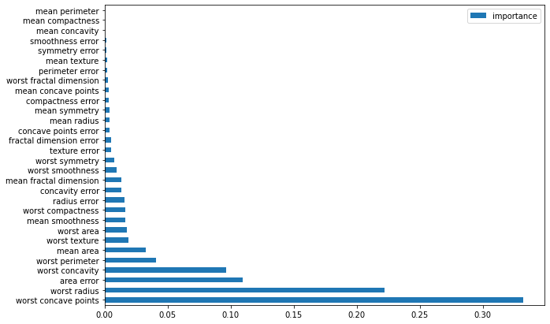

# 【机器学习应用】【Python】随机森林

> **随机森林(Randm Forest)**是集成学习算法之一，通过多个决策树共同决策，解决单个决策树过拟合的问题，随机森林的随机的主要有两部分：数据集的随机或特征选取的随机。

## 构造随机森林

### 超参数
构建随机森林模型，我们需要考虑三个关键的参数：
* `n_estimator`
* `max_samples`
* `max_features`

`n_estimators`决定一个森林由多少棵树组成。默认为100.

`max_samples`决定训练一棵决策树需要多少数据集。常采用的方法叫做有放回的抽样(bootstrap sample)，即允重复抽取同一个数据。`bootstrap=True`时，默认用所有数据集训练。

`max_features`决定每个样本选择多少特征。当`max_features`等于特征总数时，就丧失了随机性。通常而言，分类问题的`max_features`可设为$\sqrt{n\_features}$，回归问题的`max_features`可设为$\log2(n\_features)$. 默认为sqrt(n\_features).

### 集成学习
随机森林将多个决策树的预测结果集成，集成的方法为**Bootstrap Aggregation (Bagging)**，其基本步骤为：
1. 有放回的抽取`n_sample`大小的数据；
2. 用样本数据在单个决策树上训练
3. 重复1和2，最终将所有模型的预测结果取平均。

通过设置合理的`n_sample`和`max_features`，使得每个抽取出的数据集间有所差异，相关性小。由于单个决策树会在一个数据集上过拟合，多个在差异很大的数据集上过拟合的决策树集成在一起预测，反而降低了整体的过拟合程度。

这也是为什么随机森林能过更准确分类的原因之一。

## 运用随机森林

随机森林做决策的过程可以看作投票。在分类问题里，随机森林中的每一棵决策树给出每一个类别的可能性，将所有决策树给出的可能性平均，可能性最大的类别即为随机森林的结果。在回归问题中，将所有决策树的结果取平均值即为随机森林的结果。

```python
from sklearn.ensemble import RandomForestClassifier

forest_5 = RandomForestClassifier(n_estimators=5, random_state=42).fit(X_train, y_train)
forest_100 = RandomForestClassifier(n_estimators=100, random_state=42).fit(X_train, y_train)

print("Forest (n_estimators=5)- accuracy on training set: {:.3f}".format(forest_5.score(X_train, y_train)))
print("Forest (n_estimators=100)- accuracy on training set: {:.3f}".format(forest_100.score(X_train, y_train)))
print("Forest (n_estimators=5)- Accuracy on test set: {:.3f}".format(forest_5.score(X_test, y_test)))
print("Forest (n_estimators=100)- Accuracy on test set: {:.3f}".format(forest_100.score(X_test, y_test)))
```
```
Forest (n_estimators=5)- accuracy on training set: 0.991
Forest (n_estimators=100)- accuracy on training set: 1.000
Forest (n_estimators=5)- Accuracy on test set: 0.958
Forest (n_estimators=100)- Accuracy on test set: 0.965
```

## 特征重要性
当我们再将特征重要性可视化，可以发现几乎每个特征都被考虑了。这也说明了**随机森林对整体数据集更了解，得出的结果也更可靠。**


## 总结
> 随机森林的本质还是决策树，在拥有决策树优点的同时，弥补了决策树的缺点。因为随机森林选取数据样本和特征都是随机的，所以在训练时要设定`random_state`，以确保我们每次训练都得到稳定的结果。

缺点：
* 随机森林在高纬度数据和稀疏数据集上的表现可能不如线性模型。
* 随机森林对算力要求较高，当`n_estimators`很大时，训练时间会更久和内存占用会更大。

# 参考资料
 1. [《Introduction to Machine Learning with Python》](https://learning.oreilly.com/library/view/introduction-to-machine/9781449369880/)
 2. 代码：https://github.com/PengJuan-AI/Machine-Learning-Practice/blob/main/CSDN_posts/notebooks/DecisionTree%26RandomForest.ipynb