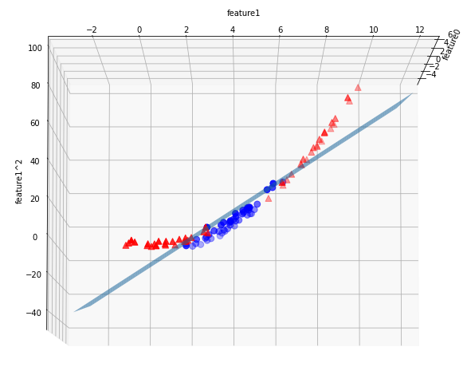

# 【机器学习应用】【Python】支持向量机——SVM

线性模型在分类问题上的应用，可看作用一条线或一个超平面在二维或三维空间将数据类别区分开，存在局限性。支持向量机(support vector machine)是更为复杂的模型，可解决线性或超平面无法解决的分类问题（线性不可分），应用于更高维度的数据。

## 理解支持向量机
### 支持向量
在分类问题中，线性模型的决策分界线即在数据之间的一条线，但这条线可以在很多位置。


如何确定分界线的最佳位置？就去找两个类别最边缘的数据点，这两种边缘点的的切线就形成了一个分类间隔。那么确定分界线的位置也就是找到分类间隔的中线。  
这个最边缘的数据点组合，也就是我们说的支持向(support vector)


> **硬间隔**不允许分类间隔间存在数据点；**软间隔**允许分类间隔中存在数据点。

总结一下，其实我们是先找到了两个类别**距离最小**的数据点，确定了分类间隔，才确定了分界线的位置，也可以说这是寻找一个全局最小值的过程。

### 非线性支持向量机 (non-linear SVM)
但在实际应用中，更多的是线性不可分的问题，假设对于一组二维数据，线性模型的分类决策分界线如下图


一条线无法将数据类别区分，而数据也只有两个特征，在此情况下，我们可以增加一个新的特征，转化为三维数据，试看能否用平面区分数据。

```python
from sklearn.datasets import make_blobs
import numpy as np

X, y = make_blobs(centers=4, random_state=0)
y = y%2 # rescale class value to 0 and 1

X_new = np.hstack([X, X[:,1:]**2])

lin_svm_3d = LinearSVC().fit(X_new, y)
coef, intercept = lin_svm_3d.coef_.ravel(), lin_svm_3d.intercept_.ravel()
# plot decision boundary plane
...
```


在三维空间中我们就找到了可以划分数据的平面。

**小结：在原数据中增加非线性特征能使线性模型预测效果更好。**

### 核技巧
像上文那样增加一个维度，在SVM中称作**核技巧**。

**核技巧(kernel trick)**

最主要的两种核技巧包括：
* 多项式核函数( polynomial kernel)
* RBF(radial basis function)核函数，也称高斯核函数(Gaussian kernel)

## 运用支持向量机
```python
from sklearn.svm import SVC

X, y = mglearn.tools.make_handcrafted_dataset()
svm = SVC(kernel='rbf', C=10, gamma=0.1).fit(X,y)
mglearn.plots.plot_2d_separator(svm, X, eps=.5)
mglearn.discrete_scatter(X[:,0], X[:,1], y)

# plot support vectors
sv = svm.support_vectors_
# class labels of support vectors are given by the sign of the dual coefficients
sv_labels = svm.dual_coef_.ravel() > 0
mglearn.discrete_scatter(sv[:, 0], sv[:, 1], sv_labels, s=20, markeredgewidth=5)
plt.xlabel("feature0")
plt.ylabel("feature1")
```


sklearn中的SVMs默认使用RBF核技巧，软间隔，上图加粗的数据点即支持向量。

## 分析支持向量机
SVMs通过`C`和`gamma`控制模型复杂度。


从左到右，`gamma`从0.1到10，决策分界线越来越专注于单个数据点。越小的`gamma`意味着决策分界线的变化越小，也意味着更简单的模型。

从上至下，`C`从0.1到1000，单个数据点对分界线的影响越大。越小的`C`意味着更受限制的模型，每个数据点对分界线的影响有限。

## 实际应用中的SVMs
以乳腺癌数据为例
```python
from sklearn.datasets import load_breast_cancer
from sklearn.model_selection import train_test_split

cancer = load_breast_cancer()
X_train, X_test,y_train, y_test = train_test_split(cancer.data, cancer.target, random_state=0)

# default: RBF
svc = SVC().fit(X_train, y_train)

print("Accuracy on traing set: {:.3f}".format(svc.score(X_train, y_train)))
print("Accuracy on test set: {:.3f}".format(svc.score(X_test, y_test)))
```
```
Accuracy on traing set: 0.904
Accuracy on test set: 0.937
```
但我们进一步理解数据的话，会发现数据之间差距很大。
```python
cancer.data.max(), cancer.data.min()
```
```
(4254.0, 0.0)
```
因为SVMs算法本质是在计算数据点之间的距离，因此不同维度的范围或规模会影响模型的准确度，所以在使用SVMs前需要了解数据，必要的话要对数据进行预处理(preprocessing)，将各维度的数据调整至相似的区间。

```python
from sklearn.preprocessing import MinMaxScaler

scaler = MinMaxScaler()

X_train_scaled = scaler.fit_transform(X_train)
X_test_scaled = scaler.transform(X_test)

svc2 = SVC().fit(X_train_scaled, y_train)

print("Accuracy on traing set: {:.3f}".format(svc2.score(X_train_scaled, y_train)))
print("Accuracy on test set: {:.3f}".format(svc2.score(X_test_scaled, y_test)))
```
```
Accuracy on traing set: 0.984
Accuracy on test set: 0.972
```
对数据rescale之后，训练集准确度和测试集准确度都大有提高。

> 数据预处理内容可参考：
### 选择合适的超参数
除了数据处理，还可以关注一下不同参数组合对模型的影响，这里使用sklearn的`GridSearchCV`。

```python
from sklearn.model_selection import GridSearchCV
params ={'C':[0.001, 0.01, 0.1, 1, 10, 100],
            'gamma':[0.001, 0.01, 0.1, 1, 10, 100]}

grid_search = GridSearchCV(SVC(), param_grid=params, cv=5)

grid_search.fit(X_train_scaled, y_train)
print("Test score: {:.3f}".format(grid_search.score(X_test_scaled, y_test)))
print("Best params: {}".format(grid_search.best_params_))

# plot params map
import pandas as pd
import seaborn as sns
results  = pd.DataFrame(grid_search.cv_results_)

scores = np.array(results.mean_test_score).reshape(6,6)

sns.heatmap(scores, cmap='RdYlGn', annot=True)
```
```
Test score: 0.972
Best params: {'C': 1, 'gamma': 1}
```


从超参数组合heatmap可以看出，不同超参数对SVMs影响很大，甚至达到最差63%最好98%的差距。

## 总结
优点：
* 得到的结果是全局最优
* 有很强的鲁棒性
* 泛化能力强
* 低纬度和高纬度数据都适用

缺点：
* 不使用于大数据集
* 需要做数据预处理
* 解释力不强
* 对超参数敏感